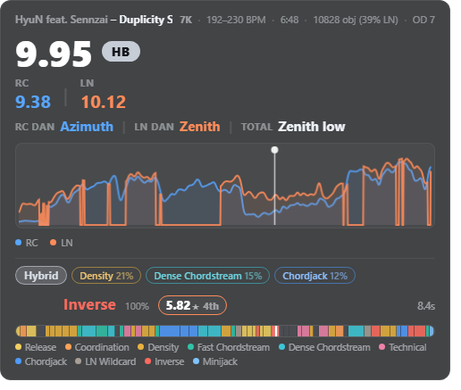
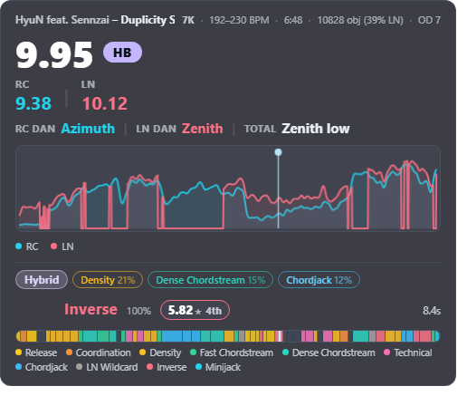
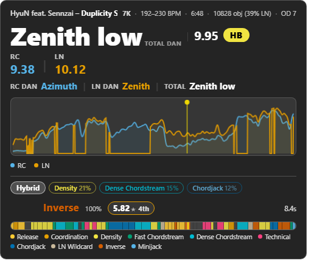
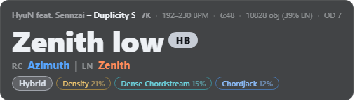

# SPM Map Analyser

A [tosu](https://tosu.app) in-game overlay for osu!mania that shows real-time difficulty ratings, dan levels and pattern classification for **4K / 6K / 7K** beatmaps.

[中文](README_zh.md)

## Features

### Difficulty rating

- **Total difficulty** (SPM stars) for the current map, plus two sub-ratings:
  - **RC** — regular (non-hold) difficulty
  - **LN** — long-note (hold) difficulty
- On pure RC maps the LN rating is hidden automatically, so you only see the numbers that matter.

### Map summary

An optional line at the top of the panel tells you what you are looking at: **artist – title [difficulty]**, the mapper, key count, BPM (a range when the chart's BPM moves), object count and play length. Values come from the tosu payload when the client exposes them and fall back to the parsed `.osu` header, so the line is complete on stable, lazer and every key count. Rate mods are taken into account — with DT/HT the BPM range and the play length follow the modded rate. A song line longer than the panel scrolls side to side instead of clipping. Toggle with **Show Map Summary**.

### Segment difficulty

While playing, the overlay follows your position and shows the current section's pattern together with its **difficulty** — the SPM star value for that section plus the equivalent dan. It is computed from the raw per-section curve (smoothing never moves the number), so the value always belongs to the section shown next to it; hover it for the section's peak and dan. 7K only. Toggle with **Show Segment Difficulty**.

### Difficulty curve

- A graph of the map's difficulty over time, occupying the lower half of the panel, with a playhead cursor following your position; the playhead turns into a pause marker while the game is paused
- Maps with both regular and hold sections draw **two lines** — **RC** (cool) and **LN** (warm) — so you can see at a glance which sections are stream-heavy and which are hold-heavy. Both lines are drawn on the same calibrated scale as the headline ratings
- **Curve smoothing** removes the jaggedness of the raw per-400 ms values. The strength is adjustable from *Off* to *Max* and is measured in pixels of the drawn curve, so one setting looks the same on a 30-second chart and on a 15-minute marathon. Peaks survive: at the default (*Medium*) the curve keeps 86% of its original peak height while shedding about 90% of its roughness (measured over a 332-map 7K corpus). Changing the strength does not re-analyse the map

### Pattern classification

The map is automatically split into sections, and each section is classified into a pattern type: **Chordjack**, **Minijack**, **Chordstream**, **Speed**, **Tech**, **Vibro**, **Coordination**, **Density**, **Inverse**, **Release**, **Technical**, **Break** and **Hybrid**.

What you get from it:

- **Overall tags** — the map's dominant pattern types shown as chips under the rating
- **Live current section** — while playing, the overlay follows your position and shows the current section's pattern, its confidence and an equivalent BPM
- **Pattern timeline** — a colour band spanning the whole map with a playhead cursor

Pattern classification currently runs on **7K** maps only; 4K/6K maps show the summary, difficulty rating, dan and curve.

### Dan mapping

- The rating is mapped to a dan ladder, calibrated separately for each key count and skill:
  - **4K RC**: 1st ~ 10th, then **Alpha / Beta / Gamma / Delta / Epsilon** · **4K LN**: 1st ~ 15th
  - **6K RC**: Start ~ 9th · **6K LN**: 0th ~ 14th
  - **7K RC / LN**: 0th ~ Stellium
- Outside the measured range it shows `< ...` / `> ...` (e.g. `< 0th`, `> Stellium`)
- Three display styles for the dan value: **thirds** (low / high), **signs** (`-` / `+`), or a **decimal number**
- Hybrid maps additionally show a **Total** dan

### Colour schemes and UI styles

Three palettes, selectable under **Color Scheme**:

| Scheme | What it is |
|--------|------------|
| **Default Dark** | The v1.0.0 palette, unchanged |
| **Aurora** | Teal/cyan for RC against coral/red for LN — a complementary pair, which separates the two families more strongly than blue/orange at small sizes — on an indigo-tinted panel |
| **High Contrast** | Near-black panel with Okabe-Ito derived hues, built for readability over bright gameplay |

Every chip and text colour in every scheme is measured against a WCAG 4.5:1 contrast target, over both a bright and a dark gameplay frame.

Two layouts under **UI Style**:

| Style | What it is |
|-------|------------|
| **Rating first** | The star rating is the headline number; dan sits on its own row below |
| **Dan first** | The dan value is the headline (the metric mania players quote) and the star rating moves next to it |
| **Minimal** | Just the summary line, the dans (total with the type badge, RC and LN) and the overall pattern tags |

**Panel Density** shrinks the whole panel: **Compact** uses smaller fonts, tighter spacing and a flatter curve to cover less of the screen.

### Other

- **Mod support** — rate-changing mods (DT / NC / HT) are taken into account
- **Hide while playing** — optionally hide the overlay once gameplay starts

## Usage

1. Download the latest release from [Releases](https://github.com/Ist1na07/spm_rating_map_analyser/releases/latest).
2. Place the folder inside tosu's `static` directory.
3. Launch tosu — find **SPM Map Analyser** in the dashboard.

## Settings

| Setting | What it does | Default |
|---------|--------------|---------|
| Rating Algorithm | Algorithm selector (reserved for future versions) | SPM Rating v1.0.0 |
| Sub Difficulty Scheme | **Direct**: RC/LN sub-ratings always come from the new sub-models. **Legacy v0.5.1**: LN maps show LN difficulty equal to the total | Direct |
| UI Style | **Rating first**, **Dan first** or **Minimal** (summary + dans + overall tags only) | Rating first |
| Panel Density | **Standard** or **Compact** panel size | Standard |
| Color Scheme | **Default Dark**, **Aurora** or **High Contrast** | Default Dark |
| Dan Display Style | How the dan value is shown: thirds (low/high), signs (-/+) or a decimal number | Thirds |
| Curve Smoothing | How much the difficulty curve is smoothed: Off, Light, Medium, Strong, Max | Medium |
| Hide While Playing | Hide the overlay after gameplay starts (shown again on the results screen) | Off |
| Show Map Summary | Show the song/difficulty/mapper/keys/BPM/objects/length line | On |
| Show Pattern Tags | Show the overall pattern chips | On |
| Show Current Segment | Show the live section pattern and equivalent BPM | On |
| Show Segment Difficulty | Show the live section's star rating and dan (7K only) | On |
| Show Segment Timeline | Show the full-map pattern colour band | On |
| Show Break Segments | Show "Break" during rest sections | On |

## Version history

### v1.0.1
- **New colour schemes**: **Aurora** and **High Contrast**, plus a WCAG contrast pass over all three palettes (chip ink, dim/faint text and the Break label were below 4.5:1 and are now above it)
- **UI Style** option: **Dan first** promotes the dan value to the headline number; **Minimal** strips the panel to the summary line, the dans (total / RC / LN, with the type badge) and the overall tags
- **Panel Density** option: **Compact** shrinks fonts, spacing and the curve
- **Map summary line**: artist/title/difficulty, mapper, key count, BPM (range when it varies), object count and length; follows rate mods; overlong song lines scroll instead of clipping — toggleable
- **Segment difficulty**: the current section's star rating and dan, next to its pattern tag — toggleable
- **Curve smoothing**: pixel-space Gaussian smoothing with five strengths, adjustable while a map is loaded; the LN line's structural zeros are preserved exactly, and the graph's x-axis now shares one time mapping with the playhead
- **Pause marker**: the playhead shows a pause glyph while the game is paused
- Fix: the RC line of the curve is now drawn from the calibrated RC sub-rating — v1.0.0 mixed raw and calibrated scales between the two lines
- The overlay no longer redraws the curve while hidden for gameplay

> Note: during this update's development we found defects in SPM Rating v1.0.0 and its accompanying algorithms; the next algorithm version will attempt to fix them.

### v1.0.0
- **Algorithm upgraded to SPM Rating v1.0.0 with the new RC/LN sub-model**
- **4K / 6K support**: difficulty rating and dan mapping now cover all key counts
- **Dan mapping rebuilt**: ladders calibrated per key count and skill (RC/LN), with `< 0th` / `> Stellium` markers beyond the measured range
- **Three dan display styles**: thirds (low/high), signs (-/+), decimal number
- **New settings**: sub-difficulty scheme (Direct / Legacy v0.5.1), dan display style, hide-while-playing
- Pure RC maps hide the LN rating and LN curve automatically
- Analysis speed optimized

### v0.5.1
- Performance: full-map analysis (pattern classification + rating) 641ms → 188ms on average; worst LN-heavy marathon maps 13.6s → 1.2s

### v0.5.0
- Pattern classification replaced with a new segment-based engine: change-point segmentation, per-segment classification, coloured pattern timeline with playhead
- Live current-section display (pattern, confidence, equivalent BPM) while playing
- Overall tags aggregated from sections; sort derived from section LN share
- Non-7K maps: classifier disabled, pattern UI hidden automatically
- Settings actually take effect now; unified colour language (RC = cool blue, LN = warm orange)

### v0.4.0
- Core SR algorithm upgraded to SPM Rating v0.4.0; correction-layer features 7 → 9 (nps_std, chord2)
- Dan mapping re-measured; LN mask calibration refitted
- Tag classifier rebuilt on 42 features

### v0.3.0
- Core SR algorithm upgraded to SPM Rating v0.3.0 (correction layer)

### v0.2.0
- Core SR algorithm upgraded to SPM Rating v0.2.0; sort/tag classifiers retrained

### v0.1.1
- Hybrid tag unified; new Inverse / Technical classifiers; Mix maps show dual RC+LN ratings; several bug fixes

### v0.1.0
- Initial release: sigmoid aggregation model with RC/LN sub-models, pattern tags, dan mapping, difficulty curve, mod support

## Ideas for later

Measured against [ManiaMapAnalyser](https://github.com/LeoBlackMT/osumania_map_analyser) by Leo_Black. These are the things that would need real work rather than a settings toggle, so they are notes rather than features:

- **Per-bucket percentile instead of per-bucket max.** Today a 400 ms bucket reports its single hardest note row, so a bucket holding one note looks as hard as a dense one. Taking the 85th percentile of the rows in a bucket would remove that bias at the source and steady the curve *without* any smoothing.
- **Cover-art accent sampling.** Tint the panel from the beatmap background image, the way LeoBlack's `coverTheme` does. Needs an image fetch and a colour quantiser.
- **Layout presets.** LeoBlack ships 15 named presets plus JSON import/export. The two UI styles and two densities here cover the useful range; a preset system only pays off with more content to preset.
- **More estimators.** LeoBlack integrates Etterna MinaCalc (five versions), Interlude, Sunny Rework, Daniel and Companella through WASM/ONNX. That is a different scale of project — bundled binaries, a worker and a benchmark harness — and it changes what the numbers mean, which is why the rating algorithm setting here is still reserved.

## Notes

- Difficulty ratings and dan levels are estimates, for reference only.
- The 7K pattern classifier is trained on limited data; rare or unusual patterns may occasionally be misjudged.
- Legacy osu!stable beatmaps (format v12 or older) may fail to parse.

## Development

`_dev/` holds the local-only tooling used to build and verify this version. It is not part of the plugin and is not needed to run it:

| Tool | What it does |
|------|--------------|
| `unit.js` | Node unit tests for the curve smoother, segment stats, metadata parser and dan labels (`node _dev/unit.js [map.osu]`) |
| `corpus.js` | Batch-validates the engines over a directory of `.osu` files and reports smoothing/segment invariants and timings |
| `serve.js` | Mock tosu server (`:24050`) that serves the overlay and emulates the v2 websocket, settings and beatmap-file endpoints for local preview |
| `shot.js` | Renders the overlay headlessly in Chrome against the mock server and writes a PNG |
| `probe_map.js` | Prints one map's rating, dans and segment list (`node _dev/probe_map.js map.osu`) |

## References

- [tosu](https://tosu.app) — the runtime this overlay runs on
- [SPM Rating](https://github.com/Ist1na07/SPMRating) — the difficulty algorithm

## License

MIT — see [LICENSE](LICENSE)
